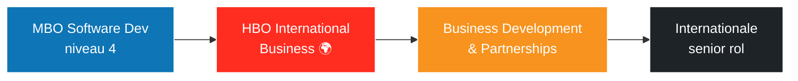

<div align="center">

```
   ▄▄▄       ▓█████▄  ▄▄▄       ███▄ ▄███▓
  ▒████▄     ▒██▀ ██▌▒████▄    ▓██▒▀█▀ ██▒
  ▒██  ▀█▄   ░██   █▌▒██  ▀█▄  ▓██    ▓██░
  ░██▄▄▄▄██  ░▓█▄   ▌░██▄▄▄▄██ ▒██    ▒██
   ▓█   ▓██▒ ░▒████▓  ▓█   ▓██▒▒██▒   ░██▒
   ▒▒   ▓▒█░  ▒▒▓  ▒  ▒▒   ▓▒█░░ ▒░   ░  ░
    ▒   ▒▒ ░  ░ ▒  ▒   ▒   ▒▒ ░░  ░      ░
    ░   ▒     ░ ░  ░   ░   ▒   ░      ░
        ░  ░    ░          ░  ░       ░
              ░
```

### `> Adam Saber — Software Developer met een business-brein 🧠💼`

**Code is mijn gereedschap. Strategie is mijn richting.**


[](https://adamsaber-mr.github.io/portofolio_mr/)


</div>

---

## `whoami`

```bash
$ cat /home/adam/profile.json
```
```json
{
  "naam": "Adam Saber",
  "leeftijd": 18,
  "locatie": "Gouda, NL 🇳🇱",
  "opleiding": "Software Development niveau 4 @ Grafisch Lyceum Rotterdam",
  "leerjaar": 2,
  "machine": "macOS 🍎",
  "huidige_richting": "Code die business begrijpt",
  "echte_richting": "Business Development & Partnerships",
  "volgende_stap": "International Business (HBO, EN) → internationale senior rol",
  "principe": "Eerlijk, halal, en niet middelmatig.",
  "status": "Building. Always."
}
```

> Ik bouw aan de **intersectie van technologie en business**. Dashboards, analytics tools, en systemen met échte business logica.
> Fulltime achter de code zitten is niet wie ik ben — mijn energie ligt in **mensen begrijpen, bedrijven analyseren, kansen zien, en vertrouwen opbouwen.**
> Code is hoe ik leer denken zoals een bedrijf denkt.

---

## `🛠️ tech-stack --list`

**Languages**


**Frameworks & Tools**


---

## `📂 ls -la ~/projects`

| Project | Stack | Wat het doet |
|--------|-------|--------------|
| 🕵️ **[Ai-Fraud-Detection](https://github.com/AdamSaber-mr/Ai-Fraud-Detection)** | `Python` `Isolation Forest` `JS` | Full-stack AI web app die frauduleuze transacties detecteert. MBO-minor eindproduct. |
| 📊 **[SaaS-Dashboard](https://github.com/AdamSaber-mr/SaaS-Dashboard)** | `Laravel` `React` `JS` | Mini-SaaS beheertool: klanten, abonnementen & terugkerende omzet (MRR / NRR / churn / Quick Ratio). |
| 🧬 **[Business-Anatomy](https://github.com/AdamSaber-mr/Business-Anatomy)** | `JavaScript` | Interactief BI-project — een bedrijf ontleed tot op het bot. |
| 🚗 **[rapid_cars](https://github.com/AdamSaber-mr/rapid_cars)** | `TypeScript` | Car rental website. |
| 🍜 **[Ramen_DeliveryApp](https://github.com/AdamSaber-mr/Ramen_DeliveryApp)** | `CSS` `HTML` | Delivery app voor het Yume ramen restaurant. |
| 🍳 **[Recipe_Website](https://github.com/AdamSaber-mr/Recipe_Website)** | `PHP` | Beroepsopdracht voor school. |

---

## `📈 git log --stat`

<div align="center">


</div>

---

## `🧭 cat roadmap.md`



---

## `💭 echo $PHILOSOPHY`

> Ik wil een sterke, rustige en principiële man zijn.
> Iemand die goed communiceert, vertrouwen uitstraalt, strategisch denkt — en eerlijk en halal handelt.
>
> Niet middelmatig. Wel verantwoordelijk. Stabiel — financieel én moreel — voor mezelf en mijn familie.

---

<div align="center">

### `connect --with adam`

[](https://adamsaber-mr.github.io/portofolio_mr/)
[](https://github.com/AdamSaber-mr)

`"Code begrijpen om business te begrijpen."`

</div>
